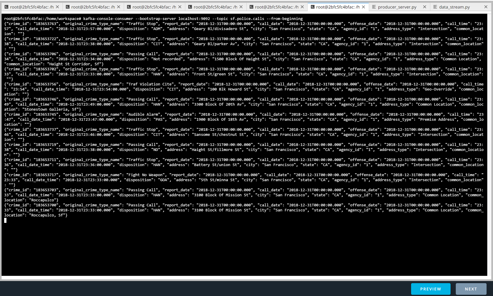

# San Francisco Crime Statistics analyzed with Spark Structured Streaming

## About
This folder includes the following scripts:   
* producer_server.py: part of a Kafka producer   
* kafka_server.py: main program to inject SF crime data into Kafka   
* data_stream.py: the program specifying the spark job   
* consumer_server.py: a custom-written Kafka consumer for testing

The folder also includes screenshots which are discussed below.

## How to run the programs
python kafka_server.py    
python consumer_server.py   
spark-submit --packages org.apache.spark:spark-sql-kafka-0-10_2.11:2.3.4 --master local[*] data_stream.py   

## Screenshots

### Screenshot 1:
It demonstrates that the Kafka server correctly ingests data into Kafka. Output from kafka-console-consumer:

### Screenshot 2:
This demonstrates output of the running Spark session from the Progress Reporter for the Join query.

### Screenshot 3:
This shows the Spark UI in action.

### Screenshot 4:
Below is a screenshot from the output of the **Aggregation Query**, counting the occurrences of different crime types.  

### Screenshot 5:
Screenshot from output of the **Join Query**, showing crime types in different time windows from the police crime input together with the description of the used radio codes from the radio_code json file.

## Answers to the questions:
#### 1.	How did changing values on the SparkSession property parameters affect the throughput and latency of the data?
A: I measured throughput using the metric “processedRowsPerSecond” from the Progress Reporter. To judge latency, I looked at metric “triggerExecution” from the Progress Reporter, job duration in Spark UI and I further calculated the processing time per message (or row).
Changing some parameters led to increasing the throughput at the cost of a somewhat longer triggerExecution time. However, I noticed based on the processing time per message, that Spark seems to work more efficiently with a larger micro batch size.

#### 2.	What were the 2-3 most efficient SparkSession property key/value pairs? Through testing multiple variations on values, how can you tell these were the most optimal?
A: In my experiments I found the following settings efficient:   
*maxOffsetsPerTrigger* had a dramatic influence on throughput as shown in the corresponding graph below. For the Join Query, the higher the value, the higher the throughput, but the higher also the latency.   
Judging by the graph below, maxOffsetsPerTrigger in range [3000 – 5000] showed the best balance between good throughput and low latency (where the knee is of the green curve in Figure 1).   

*spark.sql.shuffle.partitions*: For the aggregation query, the optimal setting of spark.sql.shuffle.partitions was 2. Values higher than 2 turned out to lead to overhead in Spark, given the Workspace VM had only 2 CPU cores. This can be seen from Figure 4 below.

To judge whether a combination is good or near optimal or in line with one's preferences (e.g. higher throughput at the cost of higher latency per batch), it helps to run lots of experiments, note the results in tables and plot graphs.

## Details from my performance analysis and more findings
Based on the following parameters a) to d) from the Progress Reporter:  
a)	numInputRows  
b)	InputRowsPerSecond  
c)	processedRowsPerSecond  
d)	triggerExecution [ms],     
I found the following relationships:   

e)	processedRowsPerSecond  = c = numInputRows / (triggerExecution/1000) = a  / (d/1000)  
f)	inferred reading time [sec] = numInputRows / inputRowsPerSecond = a/b       
This approaches in the long run the trigger interval   
g)	=c * d / 1000 = always same or *close* to numInputRows   
h)	processing time per message [ms] = d/g = 1000 / c   
i)	inputRowsPerSecond__in_long_run = numInputRows / trigger_interval. In the long run means after e.g. 30 batches.   
j)	numInputRows = ~ maxOffsetsPerTrigger,
*unless the source like Kafka producer is the bottleneck*.

- It turns out that what I called the  ‘inferred_reading_time” seems to approach the duration of the query trigger interval in the long run (after several batches). Given that’s the case, it implies, that InputRowsPerSecond and numInputRows are related by the formula:
InputRowsPerSecond_in_long_run =  numInputRows / trigger_interval
- To increase InputRowsPerSecond for a fixed query trigger_interval, we just need to raise the limit of rows we can read, i.e. increase the maxOffsetsperTrigger.
- InputRowsPerSecond, for a fixed query trigger_interval only depends on numInputRows. However, numInputRows is limited by two factors:
  - If the Kafka producer is not the bottleneck, numInputRows is limited by maxOffsetsPerTrigger. E.g. if the Kafka topic has already 200k messages in it, then with maxOffsetsPerTrigger = 1000, numInputRows will be 1000 (or close to 1000) about 200 times.
  - If the Kafka producer is the bottleneck, which occurs when the Kafka producer is started at the same time as the Spark job, and the producer rate is low (in our case determined by its sleep time), then numInputRows per microbatch will be limited by the number of events that accumulate within the query trigger duration time: e.g. if the producer rate is 10 messages/sec, and the trigger processing time is set to 20 sec, then only 200 new messages will accumulate in that time frame, so no more can be read, even if Spark were super fast or maxOffsetsPerTrigger were set to a high value.
- ProcessedRowsPerSecond is calculated for each microbatch and can vary substantially between microbatches. It is difficult to find the statistical average over many batches, as Spark UI for Spark 2.3.4 does not allow to print time series graphs. Newer Spark versions support this feature.
- In general, the more partitions there are in a Kafka cluster, the higher the throughput one can achieve as the level of parallelism increases, *however this is only true if there are sufficiently many CPU cores*.
- The degree of parallelism in the consumer in Spark (within a consumer group) is bounded by the number of partitions being consumed.
- In Spark UI, I can see that the "Total Tasks", which represents the number of partitions in a given stage. In case of no shuffles, the number of tasks will equal the number of Kafka partitions. E.g. 2 Kafka partitions leads to 2 tasks. When shuffling occurs as in our aggregation query, the number of tasks in the stage receiving the shuffled data is determined by spark.sql.shuffle.partitions.

### Influence of parameter settings on performance
#### spark.core.max:
On Spark’s standalone cluster manager, default is spark.deploy.defaultCores. It is the maximum amount of CPU cores assigned to the whole application. In the Workspace, this is 2 as per cat /proc/cpuinfo. So we don't have enough CPU cores to meaningfully experiment with this.
#### spark.deploy.defaultCores:
Default is infinite (all available cores). In the Workspace, this is 2.
#### spark.driver.memory:
For the Join Query, I changed this between 1g and 4g with little influence on the results. I believe there was never a memory shortage.
#### spark.executor memory:
I tested this for the Join Query. Result: little difference e.g. between 2g and 4g. Total memory of the Workspace VM = 7.28G as per htop, memory utilization was low.
#### spark.executor.cores:
I tested this for the Join Query with no significant influence.
#### spark.default.parallelism:
Defaults to the number of all cores on all machines. In the Workspace VM, this is 2. This leaves little room for experimentation.   
#### maxOffsetsPerTrigger:
For the Join Query, I analyzed the impact of this parameter on processedRowsPerSecond, triggerExecution time and processing time per message in detail.
The graph shows that the Spark throughput rises and the processing time per row falls with increasing maxOffsetsPerTrigger. It seems Spark processing is more efficient when the size of the batch is larger. On the other hand, latency increases for the batch, as the triggerExecution time rises.

   
**FIGURE 1**

#### Query trigger interval:
For the Join Query I also studied the performance as a function of the length of the trigger interval. As the graph shows, the length of the query trigger interval has little influence in case of the Join Query.

   
**FIGURE 2**

#### spark.sql.shuffle.partitions:
This parameter configures the number of partitions that are used when shuffling data. Default value is 200, applies to DataFrame.
I studied the influence of this parameter for both the Join Query and the Aggregation Query.
For the Join Query the graph shows no significant influence:

   
**FIGURE 3**

This seems to make sense, as when executing only the Join Query (and not the Aggregation Query), no shuffles are shown in Spark UI, when inspecting the stages.

For the Aggregation Query, Spark UI shows shuffle exchanges. This parameter then has in fact an influence on performance as shown in below graph. The smallest parameter setting was 2, which is in line with the number of CPU cores on the Workspace VM. It turns out that in the presence of only 2 CPUs, increasing the number of shuffle partitions only leads to more overhead in Spark. Thus, 2 appears optimal.

   
**FIGURE 4**

Below shows the 2nd stage for the Aggregation Query for batchId = 6, for the setting spark.sql.shuffle.partitions = 100:
On the surface, one might get the impression that a lot of parallel processing is happening.

   
**FIGURE 5**

Although above looks on the surface as if a lot of “green” Executor Computing time happens, zooming into the graph on Spark UI reveals the following:

   
**FIGURE 6**

In above graph it is clearly visible that the parallelism for the green Executor Computing phases is limited to 2. There are never more than two green bars overlapping at any time which is due to the fact that the Workspace had only 2 CPU cores. Thus, additional parallelism e.g. from more partitions only leads to stacking the tasks on the timeline and does not improve Spark’s efficiency.

#### Number of Kafka partitions
For the Join Query, modifying the number of Kafka partitions for the topic didn’t have much influence. I set it to 2, 4, and 10. The default number of Spark partitions is the same as the number of Kafka partitions. When I increased the number of partitions in the presence of only 2 CPU cores on the Workspace, the result was not conclusive enough.

## Analysis of the source json data
Below shows information about the police crime file:

  
**FIGURE 7**

Below shows information about the radio code json file:

  
**FIGURE 8**   

END
